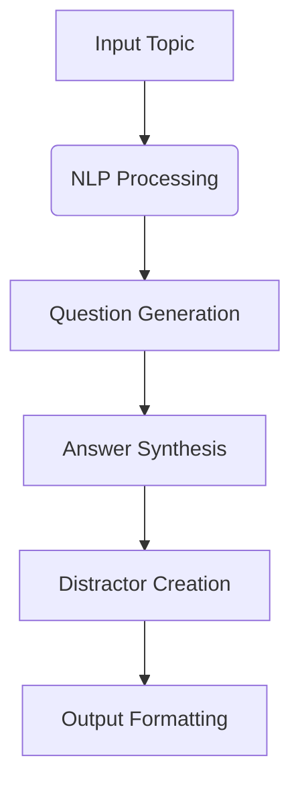

# 🤖 Automated Question Builder


An AI-powered system that automatically generates objective questions and answers from input topics.

## ✨ Features

| Feature | Description |
|---------|-------------|
| 🎯 **Smart Question Generation** | Automatically creates multiple-choice questions from any topic |
| 🔍 **Answer Synthesis** | Generates correct answers with plausible distractors |
| 🛠️ **Customizable Input** | Works with any subject matter or keywords |
| 🌐 **Web Interface** | User-friendly Flask web application |

## 🏗️ Project Structure

```bash
Automated-Question-Builder/
├── app.py              # Main Flask application
├── objective.py        # Question generation logic
├── requirements.txt    # Dependencies
└── templates/          # HTML templates
    ├── index.html
    └── results.html
```
## 🚀 Quick Start

```
# Clone repository
git clone https://github.com/ArmanAhmed00/Automated-Question-Builder.git
cd Automated-Question-Builder

# Create virtual environment
python -m venv venv
source venv/bin/activate  # Linux/Mac
# venv\Scripts\activate  # Windows

# Install dependencies
pip install -r requirements.txt

# Launch application
flask run
```


## 🧠 How It Works



### Sample Output Section
```markdown
## 📊 Sample Output

```json
{
  "topic": "Cryptography",
  "questions": [
    {
      "question": "Which is symmetric encryption?",
      "options": ["A) RSA", "B) AES (✓)", "C) ECC", "D) DSA"],
      "explanation": "AES uses same key for encryption/decryption"
    }
  ]
}
```

### License Section
```markdown
## 📜 License

[](https://opensource.org/licenses/MIT)

**Permissions**:
- Commercial use
- Modification
- Distribution

**Limitations**:
- Liability
- Warranty
```
## 🤝 Contributing

```diff
# Recommended Workflow:
+ 1. Open an issue to discuss changes
+ 2. Fork the repository
+ 3. Create feature branch (git checkout -b feat/xyz)
+ 4. Commit changes (git commit -m 'feat: add xyz')
+ 5. Push to branch (git push origin feat/xyz)
+ 6. Open pull request
```

## 📬 Contact
<div align="center">

[](mailto:armanofficial2401@gmail.com)
[](https://linkedin.com/in/armanahmed24)
[](https://github.com/ArmanAhmed00)

</div>
